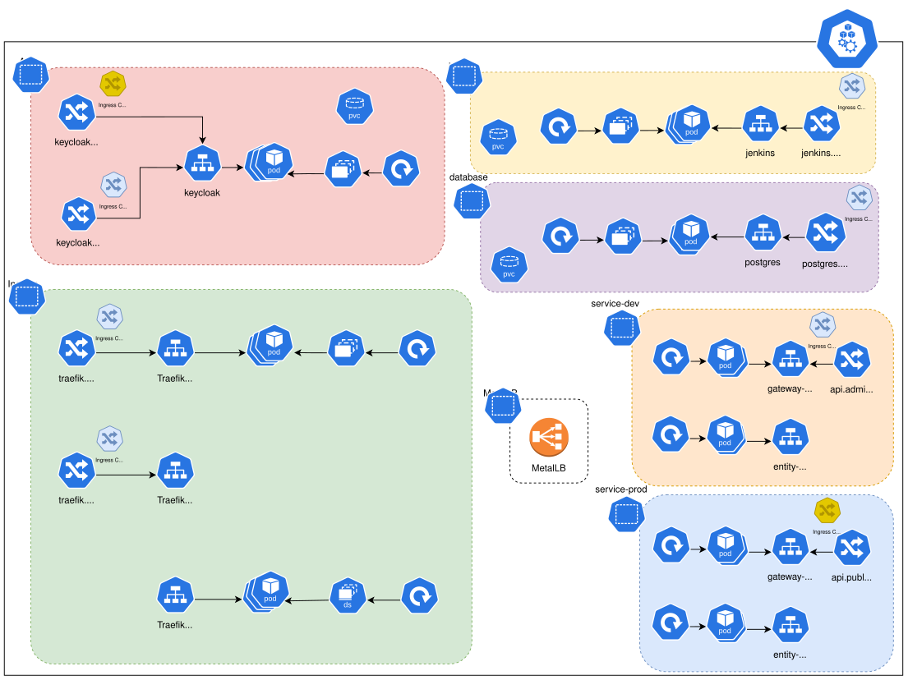

#  Diagramma dell'Infrastruttura



# Startup Ordering (Bare Metal)

Il cluster k3s su bare metal richiede un ordine di avvio corretto dopo un reboot. Questo è gestito automaticamente tramite:

1. **PriorityClasses** - Garantiscono che i componenti critici vengano schedulati prima
2. **Init Containers** - I servizi aspettano le loro dipendenze prima di avviarsi
3. **Readiness Probes** - Kubernetes non invia traffico a pod non pronti

## Ordine di Avvio

```
1. MetalLB (system-cluster-critical)
   ↓
2. Traefik Admin + Public (system-cluster-critical)
   ↓
3. cert-manager
   ↓
4. PostgreSQL microservices (infrastructure-critical)
   ↓
5. Keycloak (infrastructure-critical)
   ↓
6. Jenkins (application-standard, parallelo)
   ↓
7. story-service, estimation-service (aspettano PostgreSQL)
   ↓
8. gateway-service (aspetta Keycloak OIDC)
   ↓
9. cloudflared (aspetta Traefik public)
   ↓
10. Frontend (nessuna dipendenza bloccante)
```

## Applicazione Manuale (Disaster Recovery)

Se necessario riapplicare tutto in ordine:

```bash
cd infrastructure/
./apply-in-order.sh              # Applica tutto in ordine
./apply-in-order.sh --dry-run    # Solo verifica, nessuna modifica
./apply-in-order.sh --skip-helm  # Salta gli upgrade Helm
```

## Verifica Startup

```bash
# Verifica PriorityClasses
kubectl get priorityclass

# Verifica stato pod
kubectl get pods -A | grep -E 'metallb|traefik|keycloak|postgres|jenkins|gateway|story|estimation|frontend|cloudflare'

# Se un pod è bloccato in Init, controlla i log dell'init container
kubectl logs <pod-name> -c wait-for-postgres -n <namespace>
kubectl logs <pod-name> -c wait-for-keycloak -n <namespace>
```

## File Modificati per Startup Ordering

| File | Modifiche |
|------|-----------|
| `priority-classes.yaml` | Definisce infrastructure-critical e application-standard |
| `common/wait-scripts-configmap.yaml` | Script di wait per init containers |
| `backend/*/prod-*-manifest.yaml` | + initContainers, + probes, + priorityClassName |
| `database/microservices-postgres.yaml` | + probes, + priorityClassName |
| `cloudflare/cloudflared-deploy.yaml` | + initContainers, + probes |
| `frontend/prod-frontend-manifest.yaml` | + probes, + priorityClassName |
| `metallb/helm-values.yaml` | + priorityClassName |
| `treaefik/*/helm-values.yaml` | + priorityClassName |
| `keycloak/bitnami/bitnami-helm-values.yaml` | + priorityClassName |
| `jenkins/helm-values.yaml` | + priorityClassName |

---

# Descrizione dell'Infrastruttura Kubernetes

## 1. Cluster Overview

- **Kubernetes Cluster**: Basato su **k3s**, con un **nodo master** connesso a Internet.
- **Ingress Controller (Traefik Admin)**: Installato nel namespace `kube-system` e configurato per essere accessibile all'IP `192.168.1.30`. Questo controller gestisce l'instradamento del traffico in ingresso verso le varie applicazioni tramite le relative **Ingress Route**.
- **Ingress Controller (Traefik Public)**: Installato nel namespace `kube-system` e configurato per essere accessibile all'IP `192.168.1.31`. Questo controller gestisce l'instradamento del traffico in ingresso verso le varie applicazioni tramite le relative **Ingress Route**.
- **MetalLB**: Installato nel namespace `metallb-system` per la gestione degli IP esterni. MetalLB abilita l'esposizione dei servizi di tipo **LoadBalancer** nel cluster.

---

## 2. Componenti di MetalLB

- **Namespace**: `metallb-system`
- **Componenti**:
  - **Controller**: 
  - **Speaker**: 
  - **Webhook Service**: 

---

## 3. Namespace e Servizi

### 3.1. Namespace: `auth` (Gestione Autenticazione)

- **Keycloak**:
  - **StatefulSet**: `keycloak` (gestisce l'applicazione Keycloak).
  - **Database Postgres**: StatefulSet `keycloak-postgres` con un PVC dedicato per la persistenza dei dati.
- **Servizi**:
  - **Keycloak Service** (ClusterIP): Espone Keycloak internamente.
  - **Keycloak Headless Service** (ClusterIP): Per esigenze di service discovery.
  - **Keycloak Postgresql Service** (ClusterIP): Per il database.
- **Ingress**:
  - Route configurata su `keycloak.cluster.local` per permettere l'accesso esterno a Keycloak.
- **Sicurezza**:
  - Viene utilizzato un **Secret** per gestire le credenziali e le chiavi necessarie.

---

### 3.2. Namespace: `frontend-dev` (Frontend e Ambiente di Sviluppo)

- **Flutter Development Environment (DevEnv)**:
  - **Deployment** e **Pod**: `flutter-devenv`.
  - **Service LoadBalancer**:  
    - Esposto all'IP `192.168.1.36` sulla porta **22**.  
    - **Collegamento diretto**: Il **Developer** si collega a questo service per accedere all'ambiente di sviluppo.
  
- **Storysizer-web (Applicazione Web)**:
  - **Deployment** e **Pod**: `storysizer-web`.
  - **Service ClusterIP**: Espone l'applicazione internamente.
  - **Ingress**:
    - Route configurata su `storysizer.cluster.local` per instradare il traffico verso la web app.

---

### 3.3. Namespace: `service-dev` (Microservizi Spring Boot)

All'interno di questo namespace sono presenti due microservizi, ciascuno esposto tramite un Service di tipo ClusterIP e accessibile tramite una specifica Ingress Route.

- **Microservizio "story"**:
  - **Deployment** e **Pod**: `story`.
  - **ConfigMap**: Specifica per la configurazione del microservizio.
  - **Service ClusterIP**: Espone il microservizio internamente.
  - **Ingress**:
    - Route configurata su `api.cluster.local/story`.
  - **Autenticazione**:  
    - Il **Pod** del microservizio si collega al **Keycloak Service** per la gestione dell'autenticazione.

- **Microservizio "estimation"**:
  - **Deployment** e **Pod**: `estimation`.
  - **ConfigMap**: Specifica per la configurazione del microservizio.
  - **Service ClusterIP**: Espone il microservizio internamente.
  - **Ingress**:
    - Route configurata su `api.cluster.local/estimation`.
  - **Autenticazione**:  
    - Il **Pod** si collega al **Keycloak Service** per l'autenticazione.

- **Database Condiviso (Postgres)**:
  - Utilizzato da entrambi i microservizi (`story` ed `estimation`).
  - **Pod**: Esegue il database Postgres (indicato come `storysizer`).
  - **Persistent Volume Claim (PVC)**: Garantisce la persistenza dei dati.
  - **Connessioni**:
    - La connessione al database parte dai **Pod** dei microservizi.

---

### 3.4. Namespace: `jenkins`

- **Jenkins**:
  - **Deployment** e **Pod**: `jenkins`.
  - **Service ClusterIP**: Espone Jenkins internamente.
  - **Ingress**:
    - Route configurata su `jenkins.cluster.local` per permettere l’accesso esterno all’interfaccia di Jenkins.

---

## 4. Connessioni Esterne e Flusso del Traffico

- **Ingress Controller (Traefik)**:
  - Situato nel namespace `kube-system`, accoglie il traffico esterno all'indirizzo IP `192.168.1.30`.
  - Instrada il traffico verso le rispettive **Ingress**:
    - `keycloak.cluster.local`
    - `storysizer.cluster.local`
    - `api.cluster.local/story` e `api.cluster.local/estimation`
    - `jenkins.cluster.local`

- **Developer**:
  - Il **Developer** si collega direttamente al servizio LoadBalancer del Flutter DevEnv (IP `192.168.1.36`, porta **22**).

- **Utenti Esterni**:
  - Si collegano all'Ingress Controller, che instrada il traffico verso le applicazioni appropriate.

- **Microservizi**:
  - Il traffico verso ciascun microservizio segue questa catena:
    - **Ingress → Service (ClusterIP) → Pod → Deployment**
  - I **Pod** dei microservizi si collegano al **Keycloak Service** per l'autenticazione e al **Database Postgres** per la persistenza dei dati.

---


